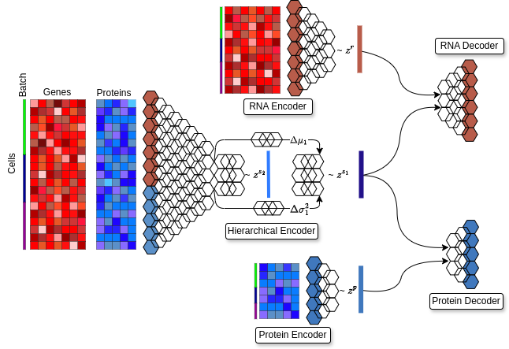

# MultiHIVE

## Overview
multiHIVE, a hierarchical multimodal deep generative model for inferring cellular embeddings by integrating CITE-seq data modalities. multiHIVE employs hierarchically stacked latent variables as well as modality-specific latent variables to capture shared and private information from the modalities respectively, facilitating integration, denoising and protein imputation and integration of CITE-seq dataset with unimodal dataset. The factorization of multiHIVE-inferred denoised expression into gene expression programs aids in identifying biological processes at multiple levels of cellular hierarchy.
<p align="center">

</p>

## Basic Installation

we recommend users to directly clone our stable main branch and set multiHIVE as the working directory and install following dependencies in a new conda environment `python>=3.10`

```bash
git clone https://github.com/Zafar-Lab/multiHIVE.git
pip install scvi-tools==0.20.0
pip install scanpy==1.10.0
pip install anndata==0.10.6
pip install scikit-misc
```

## Steps to Run
Run the `user.py` script to execute the model:

```bash
python3 user.py
```

## Tutorials
CITE-seq integration: [Tutorials/CITE_seq_Integration.ipynb](Tutorials/CITE_seq_Integration.ipynb)  
Protein Imputation: [Tutorials/Protein_Imputatoin.ipynb](Tutorials/Protein_Imputatoin.ipynb)

## Folder Structure and Parameters

1. **Main Script**:

```bash
   vae = HierarVI(adata, latent_distribution="normal", kl_dot_product=True, deep_network=True)
   vae.train()
````
   - The `user.py` script can be referred to run the model.
   
2. **Model Parameters**:

   - `latent_distribution`: Determines the probability distribution of the latent space (e.g., `Normal`).
   - `kl_dot_product`: Used for regularization of modality-specific latent distributions. Set to `True`.
   - `deep_network`: Enables multiple layers in the underlying neural network. Set to `True` if the dataset contains more than **100,000 cells**.

3. **Results**:

   - `vae.get_latent_representation()` gives zs1, zs2, zr and zp
   -  zs1 is the joint latent distribution. 
   -  zs2 is the hierarchical joint latent distribution.
   -  zr is the gene modality specific latent distribution.
   -  zp is the protein modality specific latent distribution.

4. **Additional Resources**:

   - Refer to the [scvi-tools TotalVI documentation](https://docs.scvi-tools.org/en/latest/api/reference/scvi.model.TOTALVI.html) for details on preprocessing parameters and other advanced configurations.

## Cite this article
multiHIVE: Hierarchical Multimodal Deep Generative Model for Single-cell Multiomics Integration  
Anirudh Nanduri, Musale Krushna Pavan, Kushagra Pandey, Hamim Zafar  
bioRxiv 2025.01.28.635222; doi: https://doi.org/10.1101/2025.01.28.635222
